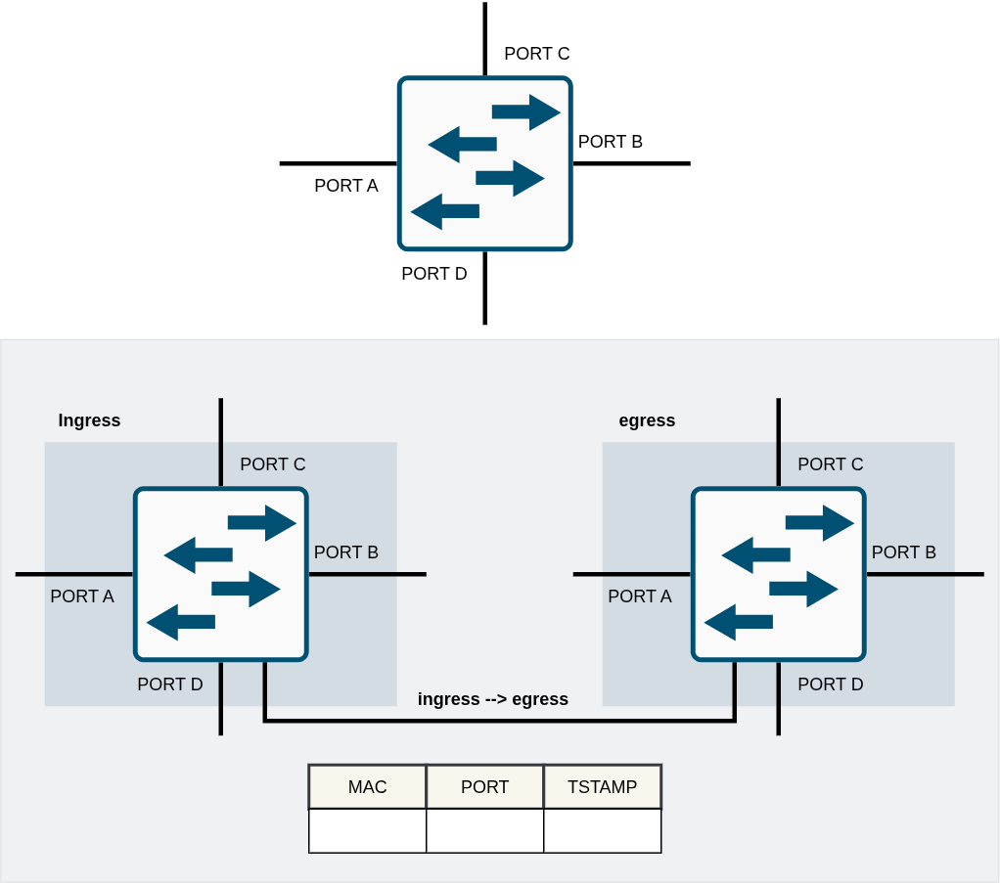
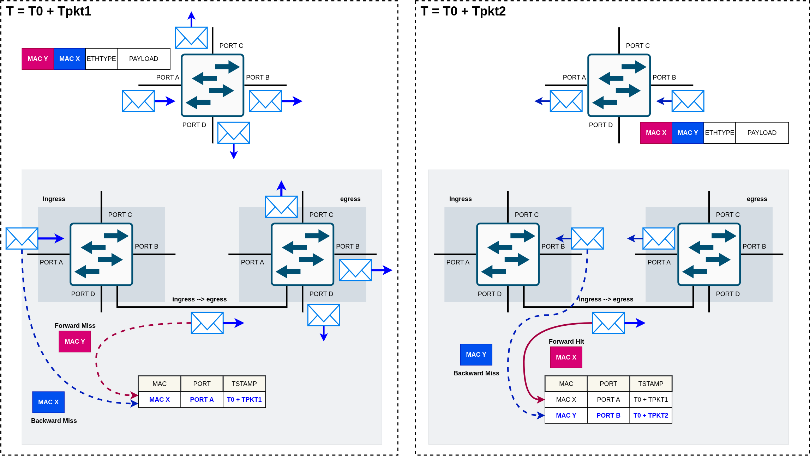
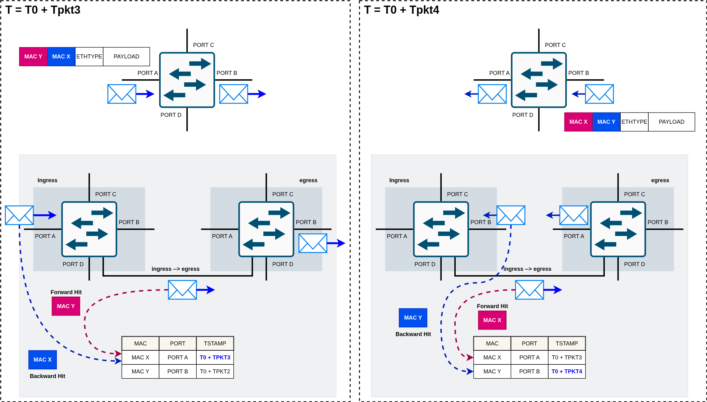
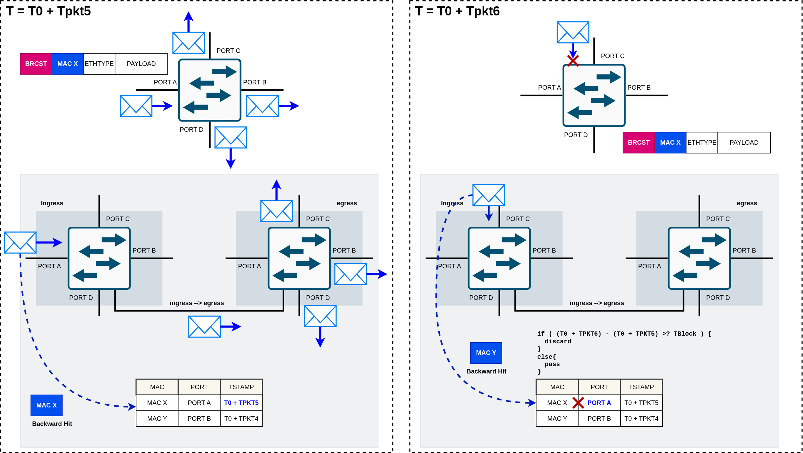
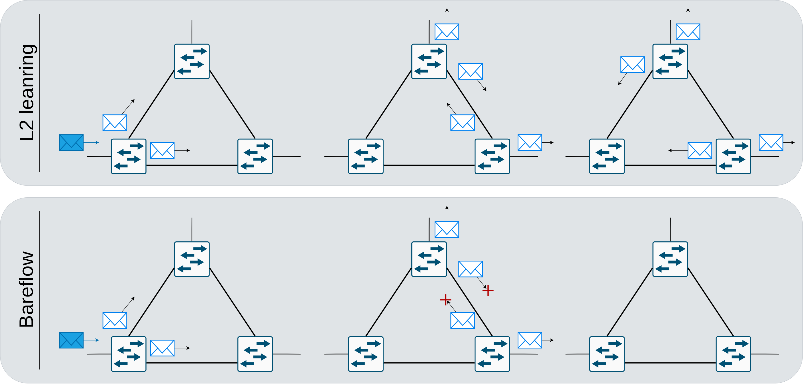

# Implemented Functionality

Bareflow, created by [Elisa Rojas](https://scholar.google.com/citations?user=Dgn0ShwAAAAJ&hl=es), modifies the *plug & play* behavior of Layer 2 bridges. While remaining fully compliant with all other coexisting protocols, it allows bridges to build communication trees in a distributed manner, without special messages or packets and without explicit communication between switches. It is also compatible with switches that do not implement this system.

**Advantages**

- No control messages or modified packets.
- Communication trees are built automatically.
- Supports ad hoc networks that configure themselves automatically.
- Self-repair: Detects link failures and takes action to restore service.

**Disadvantages**

- Setup time.
- No control over the resulting trees, since each switch makes decisions independently.

# Operation

Bareflow modifies an L2 switch's learning tables, using the entry age field to prevent loops.

If an entry's age does not exceed a threshold called the **blocking time**, any packet that contradicts that entry is dropped. In other words, if packets from a particular MAC address have been learned on a particular port, any packet with that source MAC arriving on another port is dropped. An **expiration time** is also defined, indicating how long an entry remains valid. Once this time is exceeded, the entry is deleted and must be learned again.

This approach drops packets caused by redundant links: flooding over redundant links creates packets that return to the same switch. Together with broadcast traffic, which is needed for two hosts to establish communication through ARP, this effect is known as a packet storm, because the number of packet replicas grows exponentially.

Operation is very similar to the *l2-plug&play* system.

The following figure presents the Bareflow switch as a two-stage switch: an ingress stage and an egress stage, following P4 terminology, although both are implemented in ingress.

As shown in the figure, the ingress stage handles incoming packets, while the egress stage determines their output ports.

The switch is defined by its set of ports (Port A,...,Port X) and two time values chosen by the person configuring the network:

- **Blocking time**: Defines the time window during which entries are considered to still be learning. This value should be proportional to the network diameter.
- **Expiration time**: Defines how long an entry remains usable on the switch.

## Ingress Stage Operation

The first stage of the Bareflow switch handles packet admission or dropping and entry learning or refreshing. This is known as a **Backward Hit/Miss**, depending on whether the entry already exists in the table (backward hit) or does not (backward miss).

Ingress operates only on the packet's source MAC address.

When a packet arrives, processing proceeds as follows:

- Look up the source MAC address in the learning table.
- If it is absent (backward miss), learn the entry using the packet's ingress port and arrival timestamp, then pass the packet to egress.
- If the entry is present (backward hit), calculate the difference between the entry timestamp and the packet timestamp.
- Check whether the ingress port matches the port stored in the entry.
   - If the port matches, refresh the entry timestamp to the new packet's timestamp and pass the packet to egress. This locks the entry again through a backward hit, so subsequent packets that contradict the refreshed entry are dropped.
   - If the port does not match and the time difference is less than the blocking time, drop the packet.
   - If the port does not match but the time difference exceeds the blocking time, delete the existing entry and create a new one with the packet's port and timestamp.

## Egress Stage Operation

Egress operates on the packet's destination MAC address and chooses the output port or set of ports.

When a packet passes from ingress to egress, processing proceeds as follows:

- For a broadcast address, select all switch ports except the ingress port as output ports.
- For a unicast address, look up the packet's destination MAC address in the learning table.
- If found (forward hit):
   - Calculate the difference between the packet timestamp and the entry timestamp.
   - If the time difference exceeds the expiration time:
   - If the time difference is less than the expiration time:
      - Select the port stored in the entry as the output port.
      - If the time difference exceeds the blocking time, update the entry timestamp to the packet timestamp + blocking time. This allows the entry to remain in use even though it may later be modified by a forward hit.
      - If the time difference is less than the blocking time, leave the entry timestamp unchanged.
- If not found (forward miss), send the packet through all ports except the ingress port, following normal learning-switch flooding behavior.

This describes normal operation, without the mechanism for repairing failed links.

The following figure shows the Bareflow switch's processing for unicast communication between two hosts, starting with completely empty switch tables:

The left half shows the first packet arriving from host X to host Y through port A. Processing follows the steps described above. When the packet crosses ingress, a backward miss occurs because the host has not yet been registered. A new entry is created with the packet timestamp, and the packet is passed to egress. At egress, a forward miss occurs because the destination address is also unknown, causing flooding to the remaining switch ports.

The right half shows the return packet from host Y to host X. Processing is similar to the previous packet. As it crosses the egress stage, a new table entry is recorded with the packet's port and timestamp. However, the egress lookup finds an entry for the destination address, because it was recorded on the outbound packet, resulting in a forward hit. Assuming the interval between these packets exceeds neither the blocking time nor the expiration time, the entry remains unchanged and its port is selected as the destination port.

The next figure shows how communication continues once the path is established. Since entries already exist for both addresses, the only change is to entry timestamps, which are updated through forward hits.

# Loop Prevention

Having covered basic Bareflow operation, we now explain loop prevention. To avoid repetition, the example uses a broadcast destination address, covering both broadcast storms and duplicate packet reception, since the prevention mechanism is the same.

In the figure above, host X sends a broadcast message. The Bareflow switch processes it normally, refreshing the table entry through a backward hit at ingress and sending the packet through all ports at egress.

The problem with broadcast messages, which also occurs with unicast over redundant links, is that the same packet reenters the switch through another link after another switch floods it.

To avoid processing and forwarding the packet again, causing a broadcast storm or duplicate unicast reception, Bareflow drops the packet if the blocking time has not elapsed and the frame contradicts the table. This is illustrated in the figure: when the packet returns with the same source MAC but on another port, it is dropped because the elapsed time does not exceed the blocking time. This parameter is therefore directly related to the network diameter: it represents the time a replicated packet may take to reach the switch again and be replicated once more.

# Repair Process

It's the parents, for now.
