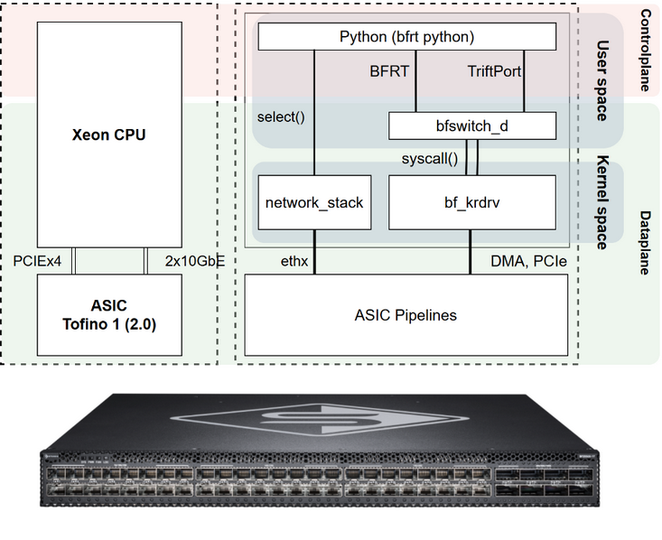
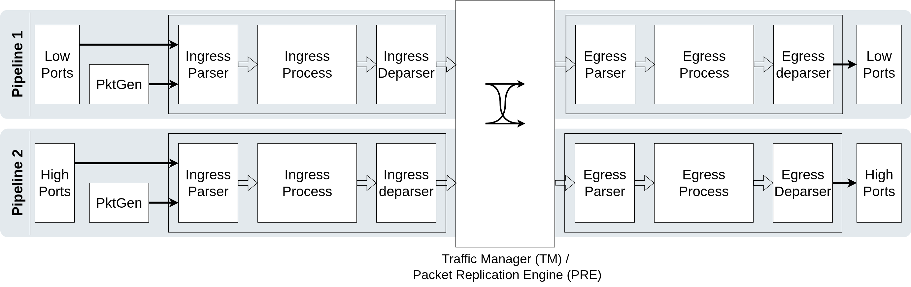
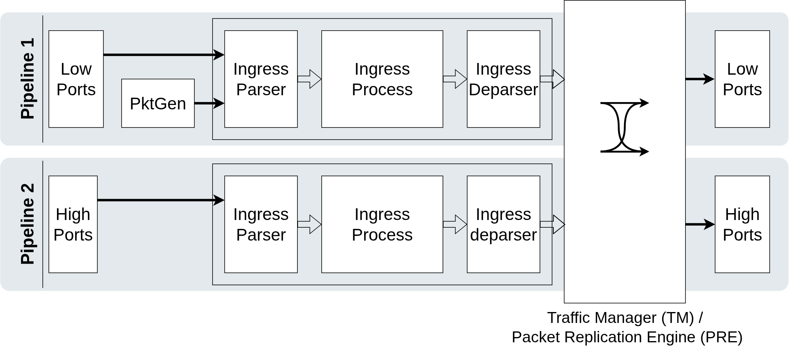

# Bareflow Implementation in P4/BFRT

This section explains the designed solution, its operation, and the processes involved. It is organized into the following sections:

- Overview
- Pipeline-controller operation

## Overview

The Bareflow self-learning system is based on a basic learning switch, modified to manage timers as described in the functional documentation.

The implementation uses switches equipped with a Tofino 1 (2.0) ASIC and a Xeon CPU connected directly to the ASIC through a PCIEx4 port and two 10 GbE ports on an internal NIC linking the processor to the ASIC.

The figure below shows the components involved in the switch. The left side shows the two main chips, the processor and the ASIC. The right side shows the processes involved in running the controller and the data plane.

### Control Plane

This plane consists of a single component: a Python script. It runs in user space on the switch's processor and manages ASIC tables and registers using `grpc`, and physical ports using `thrift`.

The controller also uses the NIC port associated with Tofino to receive recirculated packets and process them using `select()` system calls.

### Data Plane

The data plane includes all processes involved in controlling the ASIC, as well as the modules and pipelines loaded onto it. In this implementation, these are:

- `bf_switchd`: The daemon that exposes ASIC control endpoints in user space. Both the `grpc` and `thrift` clients mentioned in the control plane connect to it. It translates commands into system calls that the `bf_krdvr` kernel module uses to program the ASIC through DMA and its PCIe connection. This daemon is associated with the P4 code to be run on the switch. Before starting it, compile the P4 code describing the pipelines, then launch the daemon with that program. Different programs require different configurations, tables, and registers to be exposed.

- `bf_krdvr`: The kernel module that manages the ASIC. It is independent of the P4 program and must be loaded into the kernel before starting work. It works with `bf_switchd`, receiving instructions through system calls and translating them into register and table modifications performed through DMA and the PCIe link between the CPU and Tofino.

- `network_stack`: Included in the diagram to show that the controller receives packets recirculated from the ASIC to the CPU as ordinary packets. It uses `select()` calls to manage them and queue them in memory.

- `asic_pipelines`: The pipelines defined in the P4 code, explained later. They define the registers, tables, and other objects subsequently accessed through `grpc` or `thrift`.

The following figure shows where each block resides in the device and the modules with which it interacts.



## Pipeline-Controller Operation

This section explains how the developed system operates, covering both control plane and data plane functions. Their implementations are described separately in another section.

Before examining the program, the first aspect to consider is the Tofino architecture, shown below.



This architecture consists of two identical pipelines, which are explained together.

Each pipeline has two stages: ingress and egress. Each stage is associated with part of the device's SERDES modules: ingress with each port's receive side, and egress with its transmit side. In addition to the physical ports distributed between the pipelines, both pipelines have special ports connecting other device components to the ASIC. These include two 1G PTP ports for synchronizing each pipeline's clock with the CPU clock; two PCIe ports connecting the ASIC and CPU, used for ASIC control and packet recirculation; and the *pktgen* ports connecting the packet generator to the ASIC. The Ethernet ports communicating with the CPU are excluded from this group because they are normal ports, even though they are internal rather than on the switch's front panel.

Both ingress and egress consist of three phases: a packet parser, a processing phase, and a packet deparser. To understand the programs, note that each packet entering Tofino is managed through two elements: memory associated with the packet and a reference to the packet used for processing. This reference is built during parsing. A state machine defines which headers Tofino interprets, meaning the packet fields the program needs to choose an output. These fields are attached to the packet reference created by the parser and are available during processing.

The processing phase operates on the parsed fields using match-action tables and registers, either direct or indirect. Tables are queried using one or more packet fields and cause Tofino to execute instructions according to the control plane's configuration. Registers are memory locations that support simple operations, storing results, or comparisons; their values can be read and written by the control plane.

After processing comes the deparser. It determines the final output, whether a digest is generated, and how the packet is reserialized from memory onto the communication link. The parsing-processing-deparsing sequence is known as a parse.

Before the packet reaches the Traffic Manager, its output port or resubmit action (ingress -> ingress) must have been selected. The Traffic Manager applies queues and uses the bridge fabric to transfer the packet to the output port, where egress processing takes place before transmission.

### Program Operation

With the Tofino architecture introduced, we can now explain the system designed around it. The following figure shows the parts of the architecture used.



#### Packet Classes

The system works with several packet types that must be understood to follow its operation:

- **Normal packet**: Any packet entering the switch for the first time. As explained in the implementation section, the ASIC always adds a header that identifies whether a packet has been resubmitted, distinguishing its first ingress pass from subsequent passes.
- **Resubmitted packet**: A packet with an active resubmit header, passing through ingress for the second time.
- **PktGen packet**: A packet generated by the packet generator.
- **DP->CPU packet**: A packet sent from the ASIC (data plane) to the CPU containing a CPU header. Since it originates from the ASIC, this header contains the reason for sending it to the CPU.
- **CPU->DP packet**: A packet sent from the CPU to the ASIC containing a CPU header. Since it originates from the CPU, the header specifies the operation the ASIC must perform.

#### Headers Used in the Learning Process

Tofino always adds two headers when a packet arrives.

**`ig_intr_md`**

---

```bash
[port][timestamp][resubmit]
```

- `Port`: A 16-bit field recording the ingress port ID. This is the ASIC port ID, not the front-panel ID; use bf_cli to look up the mapping if needed.
- `Timestamp`: A 48-bit field storing the arrival time according to the ASIC clock.
- `Resubmit`: A single-bit field indicating whether the packet comes from a resubmit.

The second header varies with the packet type but is always 64 bits long.

**`port_metadata`**

---

- If the packet does not come from a resubmit, the `port_metadata` header is attached. It is programmable but is not used by this program.

**`resubmit_metadata`**

---

- If the packet comes from a resubmit, the programmable `resubmit_metadata` header contains information about the original packet. The architecture requires this header to be 64 bits long. Here it contains:

```
[orig_ts32][orig_ingress_port][pad]
```

- `orig_ts32`: A 32-bit field storing the most significant part of the original packet's 48-bit timestamp.
- `orig_ingress_port`: 16 bits indicating the packet's original ingress port.
- `pad`: 16 padding bits required to reach the mandatory 64-bit resubmit header size.

**`cpu_header`**

---

This header has the following fields:

```
[code][pad][forward][ts32]
```

Their meanings are:

- `code`: A 3-bit field. When sent from the data plane, it indicates why the packet was redirected to the CPU, called the `REASON`. When sent from the CPU, it specifies the operation the data plane must perform, called the `opcode`.

**REASONS**

| Reason DP → CPU | Value | Meaning | `forward` |
| --- | ---: | --- | --- |
| `DP_TO_CPU_CODE_LEARN` | `0` | The CPU must learn, refresh, or move the source MAC | Original ingress port |
| `DP_TO_CPU_CODE_AGED` | `1` | The destination MAC entry has aged out | `0` |
| `DP_TO_CPU_CODE_PORT_DOWN` | `2` | Event generated by pktgen when a port goes down | Failed port |
| `DP_TO_CPU_CODE_PORT_UNAVAILABLE` | `3` | Forwarding was attempted through a port that is down | Original ingress port |

**OPCODES**

| Opcode CPU → DP | Value | Meaning | `forward` |
| --- | ---: | --- | --- |
| `CPU_TO_DP_CODE_UNICAST` | `0` | Reinject through a specific port | Output port |
| `CPU_TO_DP_CODE_MULTICAST` | `1` | Reinject through flooding/multicast | Original ingress port |

- `pad`: 5 padding bits.
- `forward`: 16 bits indicating where the packet should go or where it came from, depending on its direction. For CPU->DP, it indicates the output port or PRE node to use.
- `ts32`: A 32-bit field containing the packet's arrival timestamp, using the most significant bits of the original 48-bit timestamp.

**`pktgen_port_down_header_t`**

---

The packet generator produces this header when generating a packet for a failed port. Generation itself is external to P4, but the processing of these packets must be programmed.

These packets have the following structure, defined by TNA rather than the developer:

```
[padding][app_id][padding][port_id][packet_id]
```

- `pipe_id`: Tofino has one packet generator per pipeline. Two bits identify the pipeline from which the packet originated.
- `app_id`: A three-bit identifier indicating which app generated the packet.
- `port_num`: The number of the port whose failure triggered the packet generator.
- `packet_id`: A 16-bit field identifying the packet within the generated batch.

### Program Flow

- Normal flow:
    - First pass: Process and learn the source MAC.
    - Second pass: Process the destination MAC and transmit.
- Learning flows:
    - Aging redirection: An expired entry.
    - Learn redirection: An absent entry that must be learned.
- Exception flows:
    - Port-down notification.

##### Packet Arrival Through the Ingress Deparser

When a packet enters the switch through any port, the first step is ingress parsing, including detection and classification of the packet type. Processing then follows the appropriate path.

The ingress deparser only classifies the packet and adds the metadata needed to manage it to its reference.

##### Non-Resubmitted Packet (First Pass)

When a packet first reaches the pipeline, it contains these headers:

```
[ig_intr_md][resubmit_metadata][ethernet]
```

On its first ingress pass, the learned-address table is queried. If no entry is found, the packet is redirected to the CPU with reason `Learn`. A 7-byte `cpu_header` is added with these values:

```
code = 0 # LEARN
pad = 0s
forward = original ingress port
ts32 = ingress timestamp reduced to 32 bits
```

The following is sent to the CPU:

```
[7-byte cpu_header][ethernet][payload]
```

If the address is present (backward hit), the ingress port is compared with the port stored in the table. If they match, the entry timestamp is updated. Otherwise, the time difference is checked. If it exceeds the blocking time, a learn packet is sent to the CPU, which deletes the entry and processes the packet to add a new entry and forward it, selecting the destination port or flooding as appropriate. If the difference is less than the blocking time, the packet is dropped.

If no entry matches the packet's source MAC (backward miss), a learn packet is sent to the CPU so that the control plane adds the entry to the table.

A brief note: each table lookup updates its timestamp, so care is needed to prevent an entry from being revived before the CPU deletes it. When the blocking time has elapsed and the ingress port differs from the stored port, the entry is marked invalid. Even if its timestamp has been revived, packets using this invalid entry are still redirected to the CPU.

All packets that find a matching, unexpired entry pass through ingress again, with the resubmit flag active and the resubmit header filled in.

##### Resubmitted Packet (Second Pass)

A packet reaches this stage only if its first pass did not require dropping it or processing it on the CPU.

An external review might consider the use of CPU processing excessive, but it has a specific motivation. ASIC packets are not processed sequentially: Tofino 1 can process up to 72 packets simultaneously. To prevent race conditions, packets without an explicit valid rule for their communication are redirected to the CPU. The CPU processes packets sequentially, allowing rules to be installed and packets sent in order. This design addresses the following observed situations:

- A rule was updated, but the next packet did not see the update.
- A packet's port was learned, but before the rule was installed, another packet contradicted it and caused loops.
- Packets were not dropped correctly.

For resubmitted packets, processing uses the destination MAC and follows a similar sequence to the previous stage. The learned-entry table is queried first. If no entry exists (forward miss), the PRE replicates the packet to all ports except the source port. If an entry exists (forward hit), the difference between the original packet timestamp and the table entry timestamp is calculated, giving three possible cases.

If the time difference does not exceed the blocking time, the packet is forwarded through the entry's assigned port without updating the entry timestamp.

If the time difference does not exceed the expiration time, the packet is forwarded through the stored port and the entry timestamp is updated to the original packet timestamp with an age equal to the blocking time: `t = tstamp - blocking_time`. Otherwise, refreshing the entry would lock it again, which is reserved for backward hits.

If the time difference exceeds the expiration time, the packet is sent to the CPU and the entry is marked invalid.

##### DP->CPU Redirections

A packet can be redirected from the data plane (DP) to the control plane (CPU) for the reasons indicated in the CPU header:

- `DP_TO_CPU_CODE_LEARN`: A table entry must be learned or modified.

These packets are generated when the data plane determines that a new MAC must be learned. This happens when a packet arrives with an unregistered MAC, or when the MAC is registered but its port differs and the entry is unlocked. They include the original packet as well as the learning information, because the control plane redirects the packet to its output ports through CPU->DP redirection.

- `DP_TO_CPU_CODE_AGED`: An entry has expired and has been marked invalid.

Unlike the previous case, which requires learning or relearning a MAC, AGED packets indicate that the time difference exceeds the expiration time. An aged packet includes the original packet so that the control plane can redirect it to the output ports.

- `DP_TO_CPU_CODE_PORT_DOWN`: Originates from the packet generator and identifies a port that has gone down.

These packets are received from the data plane when a port failure is detected. The data plane must then start monitoring the port to rearm the packet generator trigger and remove all table entries associated with the failed port. It must also mark the port as down in the available-port table. When the control plane subsequently directs a packet to an unavailable port, a port-unavailable packet is sent.

This packet does not contain user information: it comes from the packet generator rather than a user packet.

- `DP_TO_CPU_CODE_PORT_UNAVAILABLE`: Forwarding was attempted through a port recorded as down.

The data plane generates this packet when it directs a user packet to an unavailable port. It detects the condition and redirects the entire packet to the CPU, which must choose the appropriate output ports.

##### CPU->DP Responses

These packets allow the CPU to assign output ports after receiving a packet containing user traffic. This handles the learning race condition in which another packet contradicts an entry while the CPU is installing its rule, triggering another learning operation. Sequential CPU processing makes it possible to handle these packets correctly and prevent storms.

There are two types of CPU-to-DP packets. They have the same format and fields as DP-to-CPU packets, differing only in direction.

For DP-to-CPU packets, the Reason field tells the CPU why redirection occurred. For CPU-to-DP packets, the same field is an Opcode telling the data plane how to process the packet. Opcode 0 means that forward_port identifies the physical output port to use after removing cpu_header. Opcode 1 indicates the PRE node used to send the packet as broadcast/multicast, according to that node's configuration.

The packet format is:

```
[code][pad][forward][pad]
```

The fields contain:

- `code`: 0 (unicast) / 1 (multicast).
- `forward`: <output port number / PRE node>.

##### Port-Down Notification

This is a special packet type that does not follow the TCP/IP standard and is intended to be interpreted only by the switch itself. It is generated only when a port monitored by the packet generator goes down. The generator is connected to two ASIC ports; only one is used here.

The packet format is:

```
[padding][app_id][padding][port_id][packet_id]
```

- `pipe_id`: Tofino has one packet generator per pipeline. Two bits identify the originating pipeline.
- `app_id`: A three-bit identifier indicating which app generated the packet.
- `port_num`: The number of the port whose failure triggered the packet generator.
- `packet_id`: A 16-bit identifier for the packet within the generated batch.

The process works as follows.

When a port goes down, the packet generator sends a notification to the ASIC in this format:

```
[intrinsic_metadata][port metadata][pktgen_port_down_header_t]
```

The parser detects it and classifies it as port_down. The pipeline processes it to produce a DP->CPU packet notifying the controller of the failed port.

This second packet has the following format:

```
[cpu_header][artificial ethernet]
```

Strictly speaking, this is not a new packet, since Tofino does not generate packets in the ASIC. That would require the packet generator. Instead, the port-down notification packet is modified by removing the generator headers and adding the CPU header. Sending only cpu_header data was attempted, but the NIC connecting Tofino to the CPU drops such packets in hardware before they reach the kernel. An artificial Ethernet header is therefore added so the CPU can receive them. The Python controller places the interface in promiscuous mode to listen for these packets; otherwise, the NIC driver would drop them.
